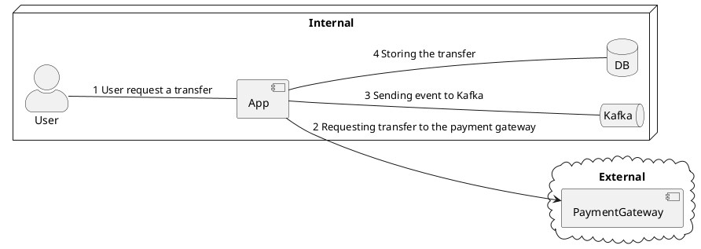

---
# try also 'default' to start simple
theme: mint
# random image from a curated Unsplash collection by Anthony
# like them? see https://unsplash.com/collections/94734566/slidev
background: https://cover.sli.dev
# some information about your slides (markdown enabled)
title: Logging Sucks (in Go)
info: |
  ## Slidev Starter Template
  Presentation slides for developers.

  Learn more at [Sli.dev](https://sli.dev)
# apply UnoCSS classes to the current slide
class: text-center
# https://sli.dev/features/drawing
drawings:
  persist: false
# slide transition: https://sli.dev/guide/animations.html#slide-transitions
transition: slide-left
# enable Comark Syntax: https://comark.dev/syntax/markdown
comark: true
# duration of the presentation
duration: 10min
hideInToc: true
---

# Logging Sucks

(In Go)

<div class="abs-br m-6 text-xl">
  <a href="https://github.com/manuelarte/talks" target="_blank" class="slidev-icon-btn">
    <carbon:logo-github />
  </a>
</div>

<!--
The last comment block of each slide will be treated as slide notes. It will be visible and editable in Presenter Mode along with the slide. [Read more in the docs](https://sli.dev/guide/syntax.html#notes)
-->

---
layout: center
hideInToc: true
---

# Use Case



---
layout: two-cols-header
hideInToc: true
---

<h1>Who Am I</h1>

* Manuel Doncel Martos
* Experience building Microservices


<br>

[<h1>logging<span style="color:red">sucks</span><v-click>.com</v-click></h1>](https://loggingsucks.com)

::left::

<div v-click class>

  ### Boris Tane

  

</div>

::right::

<div v-click class>

  ### Andrea Agosti

  [Your logs are misleading you](https://gophercamp.cz/sessions/1183304)

</div>

---
layout: default
hideInToc: true
---

# Table of contents

<Toc text-sm minDepth="1" maxDepth="1" />

---
layout: default
---

# The Why

* Many lines for a <span v-mark.underline.red>successful request</span>.
* Most of them saying "nothing" useful.
* And when something goes wrong, <span v-mark.circle.red>they miss context</span>.

---
layout: default
---

# The Fix

* Log what happened to this request.
* Logs as structured record of business events.
* For each request, <span v-mark.underline.red>emit one wide event</span>.

---
layout: default
---

# How (in Go)

<v-clicks>

- Using `context.Context`

```go
type logEvent struct {
    mu     sync.RWMutex
    fields map[string]any
}
```

- `logEvent` handled in HTTP middleware

```go
func AddLogEvent(baseLogger *slog.Logger) func(http.Handler) http.Handler {
    return func (next http.Handler) http.Handler {
        ...
		le := &logEvent{
            fields: make(map[string]any),
        }
        le.addField("requestId", reqID)
        r = r.WithContext(context.WithValue(r.Context(), logEventKey{}, le))
        next.ServeHTTP(w, r)
        // log event
        ...
    }
}
```

</v-clicks>

---
hideInToc: true
layout: image-right
image: /q_a.png
---

# Q/A


